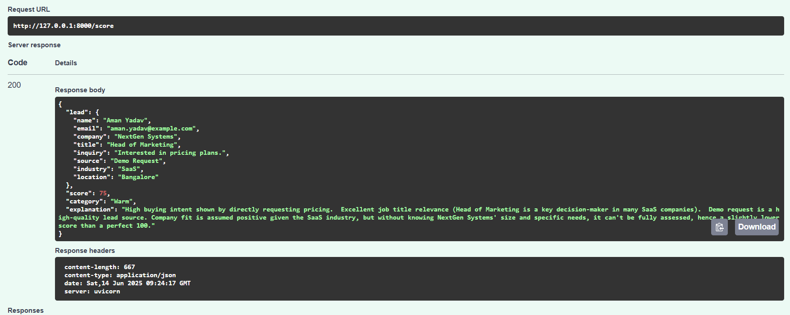

# 📊 LLM Lead Scoring Project Report

## ✅ Objective

Build an AI-powered lead scoring system using a Large Language Model (LLM) to evaluate B2B leads based on their intent, fit, and relevance.

---

## 🛠️ Tech Stack

- **Backend API**: FastAPI
- **LLM**: Google Gemini (gemini-1.5-flash)
- **Frontend**: Streamlit
- **Data Generation**: Faker Library (for fake leads)
- **Other**: Python, dotenv

---

## 🧠 LLM Scoring Logic

The LLM is prompted to evaluate each lead using the following criteria:

- Buying intent (how interested they seem)
- Company fit (e.g., industry, size)
- Job title relevance (decision-maker or not)
- Source quality (e.g., demo > LinkedIn > cold email)

**Prompt Format**:
```json
{
  "name": "Aman Yadav",
  "email": "aman.yadav@example.com",
  "company": "NextGen Systems",
  "title": "Head of Marketing",
  "inquiry": "Interested in learning more about your pricing plans.",
  "source": "Demo Request",
  "industry": "SaaS",
  "location": "Bangalore"
}
```

**Expected Output Format from LLM**:
```json
{
  "score": 75,
  "explanation": "High buying intent, good job title relevance, demo request is a high-quality source, and assumed company fit."
}
```

---

## How to Run
- Create Virtual Environment
- To run FastAPI Server 
```python
pip install -r req.txt.
uvicorn main:app --reload 
```
- To run Streamlit
- Keep Uvicorn server running for even streamlit UI
```python
streamlit run streamlit_app.py
```


## 🚀 FastAPI Endpoint

**POST** `/score`

Accepts a single lead object and returns score, category (`Hot`, `Warm`, `Cold`), and explanation.

### 🔍 Swagger UI

- URL: `http://127.0.0.1:8000/docs`
- Supports full testing of the API.

---

## 🎨 Streamlit App

- Simple UI for manually submitting lead details.
- Displays LLM-generated score, category, and explanation in real-time.
- Helps non-technical users test the AI scoring system.

---

## 📷 Screenshots

- 
- 
- 

---

## 🧪 Testing

- Manual tests were conducted using both Swagger UI and Streamlit frontend.
- LLM scoring handled edge cases like missing job titles or vague inquiries.

---

## 📝 Conclusion

This project demonstrates how a modern LLM can be effectively used to assist sales teams in evaluating incoming leads by automating qualitative assessments based on text inputs.

